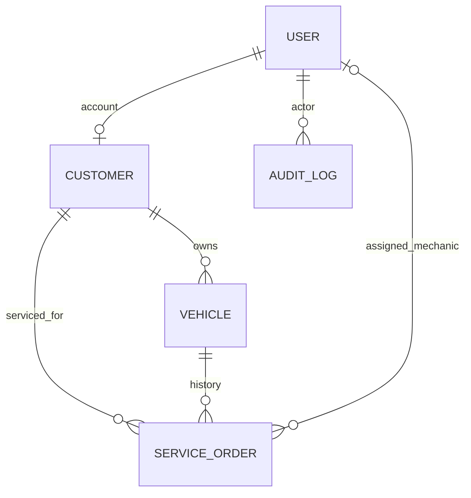

# Fondasi AJM Bengkel

AGENTS.md adalah spesifikasi utama. Implementasi baru; tidak memakai domain/schema lama.

## Audit awal

- Laravel 13.35.0, PHP 8.5.0, Livewire 4.4.7, Flux 2.20.1, Fortify.
- MySQL 8.4 tersedia; schema aplikasi hanya tabel starter, belum ada user.
- Tailwind 4, Vite 8/vite-plus, TypeScript 7 terpasang.
- Auth mencakup login, register, verifikasi email, reset password, 2FA.
- Vite/Blade masih menunjuk app.js, file aktual app.ts: 10/34 test gagal.
- PHPStan baseline kehabisan 128 MB; gunakan batas 512 MB.
- UI starter belum memiliki data operasional; tidak ada SPA lain.

## Keputusan tahap awal

- Role enum: owner, admin (termasuk kasir), mechanic, customer. Tidak perlu paket permission.
- Default registrasi selalu customer. Role bukan atribut mass-assignable.
- Owner/admin mengelola pelanggan, kendaraan, intake. Mekanik hanya order ditugaskan.
- Policies melindungi action Livewire; gate melindungi route dan navigasi.
- Owner pertama dibuat lewat console tepercaya; owner dapat provisioning staf dari UI. Tidak ada seed password default.
- Master data soft-delete. Nomor kontak/plat tetap unik setelah arsip untuk mencegah identitas ganda.
- Nomor telepon Indonesia dikanonisasi ke 62; plat uppercase tanpa spasi.
- Kendaraan punya satu pelanggan; perpindahan pemilik setelah ada transaksi belum diizinkan.
- ServiceOrder menyimpan customer snapshot relasional, mileage, complaint, diagnosis terpisah.
- Walk-in memakai satu transaksi: pelanggan/kendaraan, mileage, nomor, order.
- Nomor SRV memakai counter harian dengan unique key + row lock, bukan count + 1.
- Perubahan status/pengguna dicatat audit; stok/bon belum dibuat pada tahap ini.
- Booking/source enum disiapkan; FK booking ditambahkan saat modul booking tersedia.
- UI Flux/Blade/Livewire: kanvas netral, panel border tipis, tabel operasional, form inline,
  pencarian debounced, status berlabel/berwarna, focus/error/loading/empty states.
- TypeScript hanya shortcut pencarian; business rules tetap server-side.

## Relasi dan urutan migration

1. users: role + soft deletes.
2. customers: optional unique user_id untuk ownership portal.
3. vehicles: customer_id, unique license_plate, latest_mileage.
4. document_sequences: unique (prefix, date), value counter.
5. service_orders: customer_id, vehicle_id, mechanic_id, received_by, nomor unik/status/source.
6. audit_logs: actor_id, action, entity_type/id, context JSON tanpa secret.

## Domain lanjutan (sudah memiliki migration; status verifikasi akhir terpisah)

- Booking snapshot permintaan submitted_by, bukan bukti kepemilikan customer/vehicle; konversi admin ke tepat satu ServiceOrder lewat transaksi.
- ServiceJob dan ServiceDocumentation milik ServiceOrder; photo dapat menunjuk job.
- InventoryCategory memiliki InventoryItem; seluruh perubahan menghasilkan StockMovement.
- ServiceItem menyimpan snapshot quantity/unit_price/subtotal, mengurangi stok atomik.
- Receipt nullable service_order_id (direct sale tanpa order), customer_id, vehicle_id;
  ReceiptItem menyimpan snapshot dan nullable referensi inventory/job.
- Payment milik Receipt; uang decimal, total dihitung server-side, void tidak hard-delete.
- Stored procedure/function/trigger baru ditambah saat laporan/audit inventory tersedia.
  Objek DB harus migration-versioned dan diuji di MySQL, bukan dipaksakan pada fase people.

## Quality gate / cara menjalankan

- composer lint, composer types:check, php artisan test --compact.
- npm run types:check, npm run build.
- php artisan migrate; migration rollback/reapply diuji hanya pada DB verifikasi terisolasi.
- Tidak ada migrate:fresh pada database kerja; tidak ada commit/push otomatis.
- Jalankan composer dev setelah konfigurasi lokal tersedia.
- Staff: `php artisan workshop:create-user email@domain.test --name="Nama Staff" --role=owner`.
  Password dimasukkan melalui prompt tersembunyi, tidak sebagai argumen atau seed.
- Verifikasi DB nyata: `php scripts/verify-mysql.php` membuat schema acak `ajm_verify_*`,
  menguji migration/rollback/reapply, intake rollback, workflow, dan 4 worker nomor serentak;
  hanya schema verifikasi tersebut dihapus. Memerlukan CREATE/DROP DATABASE dan pcntl.
- `npm run test:search` menjalankan 23 check shortcut terhadap TypeScript yang dikompilasi.
- PHPStan bisa menampilkan warning ekstensi turbo pada PHP statis herd-lite; hasil analisis
  tetap dicatat terpisah dari warning startup. Tidak menyembunyikan warning atau menonaktifkan analisis.

## Batas checkpoint review pertama

Tersedia: auth/roles, pelanggan dan kendaraan, pencarian, dashboard operasional,
walk-in motor baru/terdaftar, penugasan mekanik, diagnosis, transisi status dan audit.
Portal saat ini hanya akun/settings; belum menampilkan histori pelanggan.
Belum termasuk booking, service jobs, inventory, photos, bon/payment maupun objek SQL laporan.
Jangan menyebut checkpoint ini sebagai keseluruhan sistem yang selesai.
Seluruh perubahan belum commit/push. Review manual pengguna dilakukan sebelum fase berikutnya.
