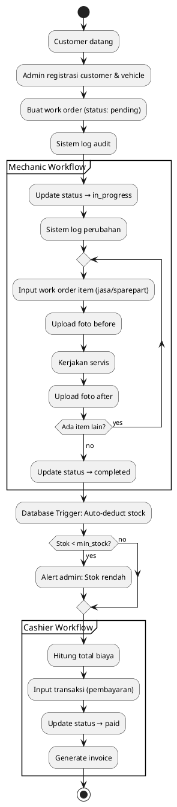

# Activity Diagram - AJM Bengkel Management System

## Activity 1: Complete Work Order Flow (End-to-End)

**Actors:** Admin/Cashier, Mechanic, System (Trigger)

### Flow Diagram

```
START
  ↓
[Customer datang ke bengkel]
  ↓
┌─────────────────────────┐
│ Admin/Cashier:          │
│ 1. Registrasi customer  │ ← (jika baru)
│ 2. Registrasi vehicle   │ ← (jika baru)
│ 3. Buat work order      │
│    - Pilih vehicle      │
│    - Assign mechanic    │
│    - Input deskripsi    │
│    - Status: "pending"  │
└─────────────────────────┘
  ↓
[Sistem log ke audit_logs]
  ↓
┌─────────────────────────┐
│ Mechanic:               │
│ 1. Lihat work order     │
│ 2. Update status →      │
│    "in_progress"        │
└─────────────────────────┘
  ↓
[Sistem log perubahan status]
  ↓
┌─────────────────────────┐
│ Mechanic:               │
│ Loop untuk tiap item:   │
│ ┌───────────────────┐   │
│ │ 3a. Input jasa/   │   │
│ │     sparepart     │   │
│ │ 3b. Hitung subtotal│  │
│ │ 3c. Upload foto   │   │
│ │     "before"      │   │
│ │ 3d. Kerjakan      │   │
│ │ 3e. Upload foto   │   │
│ │     "after"       │   │
│ └───────────────────┘   │
│ End loop                │
└─────────────────────────┘
  ↓
[Sistem log setiap work_order_item & service_photo]
  ↓
┌─────────────────────────┐
│ Mechanic:               │
│ 4. Update status →      │
│    "completed"          │
└─────────────────────────┘
  ↓
[Database Trigger: after_work_order_completed]
  ↓
┌─────────────────────────┐
│ Trigger:                │
│ UPDATE spareparts       │
│ SET stock = stock -     │
│   (quantity from items) │
└─────────────────────────┘
  ↓
[Sistem log status change & trigger result]
  ↓
Decision: Stok < min_stock?
  ├─ YES → [Alert Admin: Stok rendah]
  └─ NO  → (lanjut)
  ↓
┌─────────────────────────┐
│ Cashier:                │
│ 5. Hitung total biaya   │
│ 6. Input pembayaran     │
│    (transaksi)          │
│ 7. Update status →      │
│    "paid"               │
└─────────────────────────┘
  ↓
[Sistem log transaksi & status change]
  ↓
[Generate invoice/struk] (optional)
  ↓
END
```

---

## Activity 2: Rollback Audit Log

**Actor:** Admin

### Flow Diagram

```
START
  ↓
[Admin buka Audit Logs]
  ↓
Decision: Filter by table/action/date?
  ├─ YES → [Apply filter]
  └─ NO  → (tampilkan semua)
  ↓
[Admin pilih entry untuk rollback]
  ↓
[Sistem cek: canRollback()?]
  ↓
Decision: Rollback diizinkan?
  ├─ NO → [Tampilkan error: sudah di-rollback atau data conflict]
  │        ↓
  │        END (gagal)
  └─ YES → (lanjut)
       ↓
[Tampilkan modal konfirmasi]
  ↓
Decision: Admin konfirmasi?
  ├─ NO  → END (batal)
  └─ YES → (lanjut)
       ↓
┌─────────────────────────┐
│ Sistem (Rollback):      │
│ BEGIN TRANSACTION       │
│                         │
│ Switch (action):        │
│ ┌───────────────────┐   │
│ │ CASE "create":    │   │
│ │   DELETE record   │   │
│ ├───────────────────┤   │
│ │ CASE "update":    │   │
│ │   RESTORE         │   │
│ │   old_values      │   │
│ ├───────────────────┤   │
│ │ CASE "delete":    │   │
│ │   RE-INSERT       │   │
│ │   old_values      │   │
│ └───────────────────┘   │
│                         │
│ Mark audit log:         │
│ new_values[             │
│   "_rolled_back_at"     │
│ ] = now()               │
│                         │
│ COMMIT TRANSACTION      │
└─────────────────────────┘
  ↓
Decision: Rollback sukses?
  ├─ NO  → [Tampilkan notifikasi error]
  │         ↓
  │         END (gagal)
  └─ YES → [Tampilkan notifikasi sukses]
            ↓
            [Refresh audit log list]
            ↓
            END (sukses)
```

---

## Activity 3: Auto Stock Deduction (Trigger)

**Actor:** Database Trigger

### Flow Diagram

```
TRIGGER: after_work_order_completed
ON: work_orders table UPDATE
  ↓
Decision: NEW.status = "completed" 
          AND OLD.status != "completed"?
  ├─ NO  → EXIT (trigger tidak jalan)
  └─ YES → (lanjut)
       ↓
[Query: Get all work_order_items 
        WHERE work_order_id = NEW.id
        AND sparepart_id IS NOT NULL]
  ↓
Decision: Ada item dengan sparepart?
  ├─ NO  → EXIT (tidak ada stok yang di-deduct)
  └─ YES → (lanjut)
       ↓
┌─────────────────────────┐
│ Loop each item:         │
│ ┌───────────────────┐   │
│ │ UPDATE spareparts │   │
│ │ SET stock =       │   │
│ │   stock - qty     │   │
│ │ WHERE id =        │   │
│ │   sparepart_id    │   │
│ └───────────────────┘   │
└─────────────────────────┘
  ↓
Decision: Stok jadi negatif?
  ├─ YES → [Log warning: oversold]
  │         (rollback manual via audit log)
  └─ NO  → (normal)
       ↓
EXIT (trigger selesai)
```

---

## Plantuml Syntax (Activity Diagram 1)



---

## Summary

**3 Activity Diagrams:**
1. **Complete Work Order Flow** - End-to-end dari customer datang sampai lunas
2. **Rollback Audit Log** - Admin restore data via audit trail
3. **Auto Stock Deduction** - Database trigger workflow

**Key Decision Points:**
- Filter audit logs (optional)
- Confirm rollback (required)
- Stock alert (automatic)
- Rollback success/fail handling
