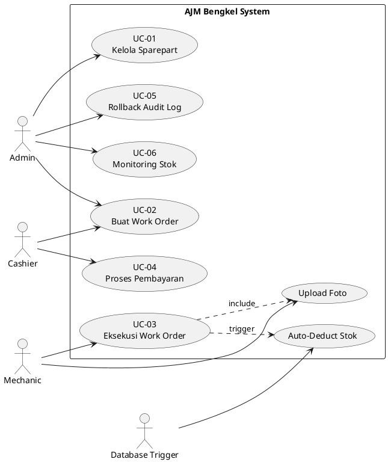

# Use Case Diagram - AJM Bengkel Management System

## Actors

### 1. Admin
- Kelola semua data master (sparepart, customer, vehicle)
- Kelola work order
- Kelola user (mechanic, cashier)
- Lihat & rollback audit log
- Lihat laporan keuangan

### 2. Mechanic (Mekanik)
- Lihat work order yang ditugaskan
- Update status work order
- Input item pengerjaan & sparepart yang digunakan
- Upload foto dokumentasi pengerjaan
- Tandai work order selesai

### 3. Cashier (Kasir)
- Lihat work order yang sudah selesai
- Input pembayaran (transaksi)
- Update status work order menjadi "paid"
- Cetak invoice/struk

### 4. Customer (via Public Website - Optional Future)
- Lihat riwayat servis kendaraan
- Lihat dokumentasi foto pengerjaan
- Cek status work order realtime

---

## Use Cases

### UC-01: Kelola Inventaris Sparepart
**Actor:** Admin  
**Deskripsi:** Admin menambah, mengubah, atau menghapus data sparepart. Sistem mencatat perubahan di audit log.  
**Precondition:** Admin sudah login.  
**Flow:**
1. Admin masuk ke menu Spareparts
2. Admin melakukan CRUD operation
3. Sistem menyimpan data & mencatat ke audit_logs
4. Sistem menampilkan notifikasi sukses

**Alternate Flow:**
- Stok < min_stock → sistem highlight merah
- Rollback tersedia via audit log

---

### UC-02: Buat Work Order Baru
**Actor:** Admin / Cashier  
**Deskripsi:** Mencatat pekerjaan servis kendaraan customer baru.  
**Precondition:** Customer & vehicle sudah terdaftar.  
**Flow:**
1. Admin pilih menu Work Orders → Create
2. Pilih vehicle (otomatis load customer)
3. Assign mechanic
4. Input deskripsi pekerjaan
5. Sistem create work order dengan status "pending"
6. Sistem log ke audit_logs

---

### UC-03: Eksekusi Work Order (Mekanik)
**Actor:** Mechanic  
**Deskripsi:** Mekanik mengerjakan & mendokumentasikan servis.  
**Precondition:** Work order status = "pending" atau "in_progress"  
**Flow:**
1. Mekanik buka work order yang ditugaskan
2. Update status → "in_progress"
3. Tambah work order items (jasa + sparepart)
4. Upload foto dokumentasi per item
5. Tandai selesai → status "completed"
6. **Trigger database:** auto-deduct stok sparepart
7. Sistem log semua perubahan ke audit_logs

---

### UC-04: Proses Pembayaran
**Actor:** Cashier  
**Deskripsi:** Kasir mencatat pembayaran customer & update status.  
**Precondition:** Work order status = "completed"  
**Flow:**
1. Kasir buka work order yang selesai
2. Hitung total biaya (SUM work_order_items.subtotal)
3. Input transaksi (type: "income")
4. Update work order status → "paid"
5. Sistem generate invoice/struk (optional)

---

### UC-05: Rollback Data via Audit Log
**Actor:** Admin  
**Deskripsi:** Admin mengembalikan data ke kondisi sebelumnya.  
**Precondition:** Ada entry di audit_logs yang belum di-rollback.  
**Flow:**
1. Admin buka Audit Logs
2. Filter by table/action/date
3. Pilih entry yang mau di-rollback
4. Klik action "Rollback" → konfirmasi
5. Sistem restore data dari `old_values` JSON
6. Sistem tandai audit log sebagai "_rolled_back_at"

**Business Rule:**
- Create → delete record
- Update → restore old_values
- Delete → re-insert old_values

---

### UC-06: Monitoring Stok Rendah
**Actor:** Admin  
**Deskripsi:** Sistem otomatis highlight sparepart dengan stok < min_stock.  
**Trigger:** Setiap kali stok berubah (manual atau via trigger)  
**Flow:**
1. Sistem cek `stock < min_stock`
2. Tampilkan badge merah di tabel Spareparts
3. (Optional) Kirim notifikasi/email ke admin

---

## Diagram (Plantuml Syntax)

---

## Summary

Total **6 primary use cases** covering:
- Inventory management dengan alert stok rendah
- Work order lifecycle (create → execute → payment)
- Audit trail dengan rollback capability
- Photo documentation per service item
- Automatic stock deduction via database trigger
