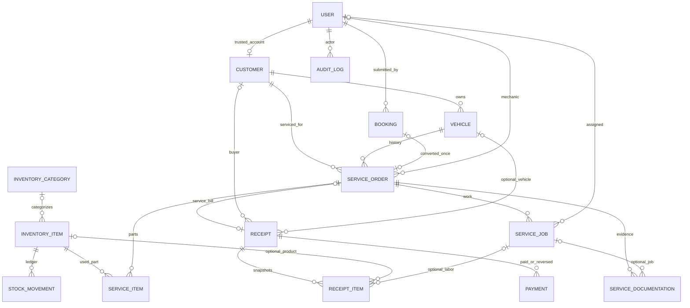

# Domain final AJM Bengkel

AGENTS.md adalah spesifikasi. Schema dibangun bertahap; 19 migration domain setelah
starter authentication. Booking snapshot bukan customer master otomatis.

## Transaction boundaries

- Intake: customer/vehicle reuse atau create, mileage, nomor dan order satu transaksi.
- Booking: lock request lalu intake; unique booking_id dan status konversi idempotent.
- Jobs: lock order lalu job; assigned mechanic authorization; price decimal string.
- Parts: lock order, optional receipt, part, inventory. Snapshot harga/nama; ledger/audit
  atomik. Return idempotent; cancellation mengembalikan part dalam transaksi status.
- Direct sale: lock receipt, inventory ascending ID. Finalisasi recalculation dan
  snapshot; stok berkurang sekali. Receipt PNG divalidasi sebelum final commit.
- Service bon: lock order lalu receipt. Pekerjaan completed dan part nonreturned diambil;
  tidak ada pengurangan stok kedua. Final melarang edit jobs/part yang memengaruhi bon.
- Payment: lock receipt; positive/balance validation; decimal total; reversal/void
  owner beralasan. Koreksi tidak menghapus transaksi atau otomatis mengirim refund.
- Documentation: order lock, actual image validation, private random path, audit;
  storage cleanup bila transaksi gagal. Removal logical; terminal orders read-only.
- Linking: lock customer dan target verified customer account; FK unique nullable,
  konfirmasi kepemilikan offline wajib; unlink/relink audit ID saja.

## Lifecycle / historical integrity

Masters user/customer/vehicle/inventory soft delete. Transaksi tidak dihapus melalui
UI. Stock movements immutable melalui model. Receipt snapshot identitas/item/harga
mencegah perubahan master mengubah bon final. Logo lama tetap disimpan karena
snapshot bon lama dapat merujuk file tersebut. Part returned_at dan payment reversed_at
menyimpan reversal eksplisit. Customer portal memeriksa owner saat ini per request;
link akun tidak dibuat otomatis dari informasi kontak.

## Simplifikasi sengaja

- Integer quantity untuk unit stok; bukan dispensing pecahan.
- Satu receipt per service order, termasuk receipt voided; tidak menerbitkan pengganti
  otomatis. Koreksi memakai lifecycle yang terlihat dan audit.
- No public anonymous receipt sharing: protected authenticated downloads saja.
- QRIS/transfer dicatat manual; tidak ada settlement gateway.
- Financial report penerimaan/reversal/net, bukan laba atau advanced accounting.
- Auth owner/admin/mechanic/customer enum; tidak ada permission package berlebihan.

Instruksi operasi dan verifikasi: docs/operations.md. Hasil pengujian aktual dicatat
terpisah dari diagram/desain; diagram bukan bukti keberhasilan implementasi.
